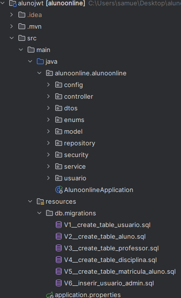

Spring_Atividade_Aluno – API com JWT, Roles e MySQL

Este projeto é uma API REST desenvolvida com Spring Boot, voltada para o gerenciamento acadêmico de uma instituição de ensino.
Ela permite controlar alunos, professores, disciplinas, matrículas, notas e histórico escolar, além de possuir autenticação e autorização com JWT, e gerenciamento de roles (ALUNO, PROFESSOR e ADMIN).

🚀 Tecnologias Utilizadas

- Java 21
- Spring Boot 
- Spring Security + JWT
- Spring Data JPA
- MySQL
- Flyway
- Swagger (OpenAPI)
- Maven

📁 Estrutura do Projeto

🔐 Autenticação e Autorização (JWT)

- A API utiliza Spring Security + JWT para proteger os endpoints.

🔑 Como funciona

- O usuário acessa /auth/login com login e senha.
- Se for válido, a API retorna um token JWT.
- O token deve ser enviado no header:
- Authorization: Bearer SEU_TOKEN
- As roles definem o que cada um pode acessar:

🧩 Roles disponíveis

ROLE_ADMIN,
ROLE_PROFESSOR,
ROLE_ALUNO

Cada endpoint pode ser restrito a um ou mais papéis.

ADMIN
- CRUD de Aluno, Professor e Disciplinar
- Matricular Alunos em discipinas

👨‍🎓 Alunos

- Emitir histórico

🧑‍🏫 Professores

- Atualizar notas

📚 Funcionalidades da API

🔐 Autenticação com JWT

Login

Criação de usuários (Flyway inicial já insere um ADMIN)

🌐 Documentação Swagger

Acesse após rodar o projeto:

👉 http://localhost:8080/swagger-ui/index.html

🧪 Testes com Postman

Arquivo incluso na raiz do projeto:

📁 Alunos_Casa.postman_collection.json

Basta importar no Postman.

🗄️ Banco de Dados – MySQL + Flyway

Scripts de criação automática:

📂 src/main/resources/db.migrations/

Exemplos no projeto:

V1__create_table_usuarios.sql

V2__create_table_alunos.sql

V3__create_table_professores.sql

V4__create_table_disciplinas.sql

V5__create_table_matriculas.sql

V6__inserir_usuario_admin.sql

Sempre que o projeto inicia, o Flyway executa as versões novas.

⚙️ Como rodar o projeto
Pré-requisitos

Java 21

Maven

MySQL

1. Clone o repositório
   git clone https://github.com/SamuelloranD/spring-aluno-online-jwt.git

2. Configure o application.properties
   spring.datasource.url=jdbc:mysql://localhost:3306/alunoonline?useSSL=false&serverTimezone=UTC
   spring.datasource.username=seu_usuario
   spring.datasource.password=sua_senha

spring.jpa.hibernate.ddl-auto=none
spring.jpa.show-sql=true

spring.flyway.enabled=true
spring.flyway.locations=classpath:db.migrations

api.security.token.secret=seu_segredo_jwt

3Rodar o projeto
   ./mvnw spring-boot:run

👨‍💻 Desenvolvido por

Samuel Lorand